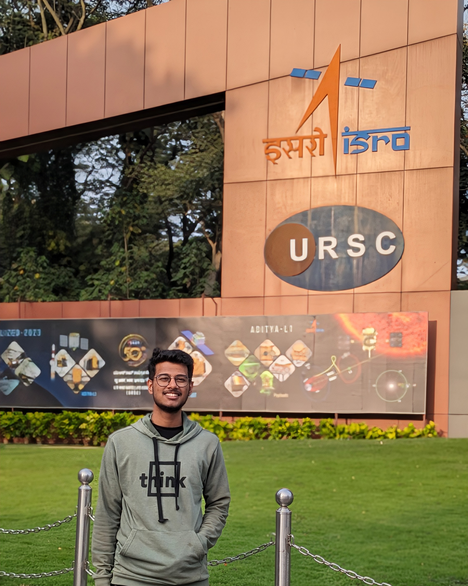

  

Hey there 👋 I'm Gaurang, I work on Agents and Language Models (RAG, Knowledge Graphs) in Applied Research at Raytheon Technologies. My board research interests include: Agentic AI, Mechanistic Interpretability, and fundamental deep learning. 

### Previous Experience
1. **ML Intern @ Raytheon Technology**: Worked on improving interpretability of SAR data and fusing them with multispectral and optical images.
2. **Project Intern @ ISRO (URSC)**: Worked on developing LSTM & GNN-based Inter-Satellite Link (ISL) algorithms for satellite communication. Also, prototyped a novel satellite constellation for Lunar-Earth Communication. Mission Support for the Aditya-L1 mission.
3. **ML Intern @ LIGO India (IUCAA Pune)**: Worked on identification of gravitational waves from Binary Black Hole Merger.

### Other Achievements
1. Hold 2 trade secrets for my work at ISRO.
2. Co-founded Space Research Group at university (MIT Pune).

### Research Interests
**TLDR**: Still exploring
1. Large Language Model: Reasoning

### ML Notes
- [[Do DL models overfit?]]
- [[Neural Collapse & Long-Tail in NN]]

### LLM Essentials
- [[Quantization]]
